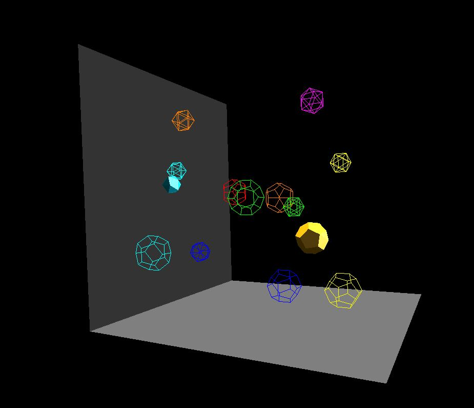

# Keytime-Animations
Animate an object using keyframe animation methods with OpenGL API.

Link to Youtube demonstration: https://youtu.be/5TcVoq069DA

---

This program uses keyframes to interpolate the animation of two dodecahedrons! The position, size, and color of these two shapes is determined for specific points in time (using class KeyTimes), and then the program helps to smoothly transition from one key frame to the other. The keyframes are shown as wire meshes, whihc can be seen three seconds into the demonstration video and scattered throughout the space in the thumbnail.

Skeleton code (Window creation, mouse integration, etc.) provided by Dr. Mike Bailey of Oregon State University!
